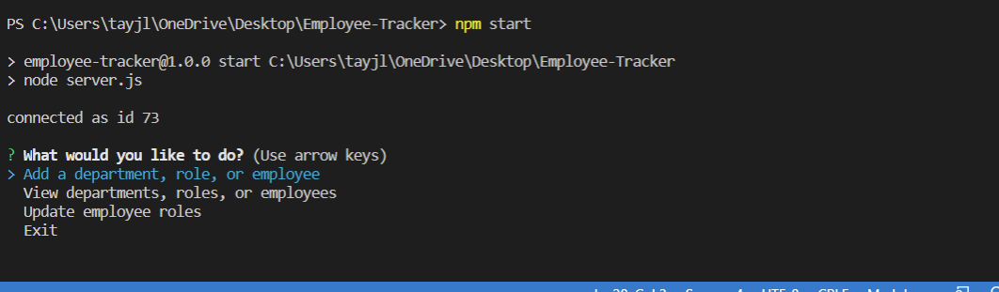

# Employee-Tracker

[](https://opensource.org/licenses/MIT)

# Description 

This applications lets the user view and manage the departments, roles, and employees in the user's company so that they can better organize their business. 

# Preview




# Installation
Clone or fork the repo. 
Go to the root directory. 
Open a new integrated terminal. 
Then npm install all of the dependencies. 
```
npm i 
```
Make sure your password for your MySQL account replaces the const pass. 
```
const connection = mysql.createConnection({
    host: 'localhost',
  
    port: 3306,
  
    user: 'root',
  
    password: pass,
    database: 'employee_db',
  });
```
Please also have Node.js installed beforehand. 
Then run npm start or node server.js

# Links 
Github repo: https://github.com/tjl2125/Employee-Tracker


# Contact
[Github profile](https://github.com/tjl2125)

[Email](tjl2125@alum.barnard.edu)

# Contributing 
Fork the repo.
Send a pull request or email me if any issues/improvements you find. 

# License

Copyright <2021> <Taylor Leong>

Permission is hereby granted, free of charge, to any person obtaining a copy of this software and associated documentation files (the "Software"), to deal in the Software without restriction, including without limitation the rights to use, copy, modify, merge, publish, distribute, sublicense, and/or sell copies of the Software, and to permit persons to whom the Software is furnished to do so, subject to the following conditions:

The above copyright notice and this permission notice shall be included in all copies or substantial portions of the Software.

THE SOFTWARE IS PROVIDED "AS IS", WITHOUT WARRANTY OF ANY KIND, EXPRESS OR IMPLIED, INCLUDING BUT NOT LIMITED TO THE WARRANTIES OF MERCHANTABILITY, FITNESS FOR A PARTICULAR PURPOSE AND NONINFRINGEMENT. IN NO EVENT SHALL THE AUTHORS OR COPYRIGHT HOLDERS BE LIABLE FOR ANY CLAIM, DAMAGES OR OTHER LIABILITY, WHETHER IN AN ACTION OF CONTRACT, TORT OR OTHERWISE, ARISING FROM, OUT OF OR IN CONNECTION WITH THE SOFTWARE OR THE USE OR OTHER DEALINGS IN THE SOFTWARE.
